```mermaid
classDiagram
    %% Основные интерфейсы и абстрактные классы
    class AffectsStat {
        <<interface>>
    }
    
    class AffectsStatBackground {
        <<interface>>
        +apply(stats, tools, langs, context)
        +delete(stats, tools, langs)
    }
    
    class AffectsStatClass {
        <<interface>>
        +apply(health, stats, skills, armor, weapons, tools, context)
        +delete(health, stats, skills, armor, weapons, tools)
    }
    
    class AffectsStatRace {
        <<interface>>
        +apply(stats, size, speed, langs, tools, armor, health)
        +delete(stats, size, speed, langs, tools, armor, health)
    }
    
    class Stat {
        <<interface>>
    }
    
    class Updateable {
        <<interface>>
        +List~Modifier~ affectedby
        +update(effect, flags)
        +deletebyMeta(metaFlag)
    }
    
    class ProfBonusStat {
        <<interface>>
        +int hasprofbounus
    }
    
    class Pickable {
        <<interface>>
        +Set~String~ menu
        +Set ret
        +pick(context)
        +pickmany(context, initialSelections, howmany, include)
    }

    %% Основные классы статистик
    class BasicStat {
        +int value
        +int mod
        +int savingthrow
        +List~Modifier~ affectedby
        +Stat2Modifier() int
        +update(effect, flags)
        +deletebyMeta(metaFlag)
    }
    
    class Skill {
        +BasicStatNames bs
        +Meta metadata
        +int hasprofbounus
        +addMeta(flag)
        +string2skill() Map~String,Skills~
        +deletebyMeta(skills, flag)
    }
    
    class Health {
        +int max_health
        +int current_health
        +DiceType? HitDice
        +List~Modifier~ affectedby
        +update(effect, flags)
        +deletebyMeta(metaFlag)
    }

    %% Классы персонажа
    class Character {
        +BuildContext UIContext
        +String name
        +Race? race
        +Background? bg
        +CharClass? class_;
        +BasicStat STR, DEX, CON, INT, WIS, CHR
        +Skill Acrobatics, Animal_Handling, etc.
        +Set~ToolSkill~ tools
        +Set~Langs~ langs
        +Health health
        +Set~Armor~ CanUseArmor
        +Set~Weapon~ canUseWeapon
        +Money wallet
        +List~Item~ inventory
        +Size? size
        +int? speed
        +getallstats() Map~StatNames,Stat~
        +getbasicstats() Map~BasicStatNames,BasicStat~
        +getskills() Map~StatNames,Skill~
        +getToolingskills() Set~ToolSkill~
        +getLangs() Set~Langs~
        +getModifier(statName) int
    }
    
    class Background {
        <<abstract>>
        +factory Background(chosen, character)
    }
    
    class CharClass {
        <<abstract>>
        +factory CharClass(chosen, character)
    }
    
    class Race {
        <<abstract>>
        +Set~Trait~ traits
        +List~MindSets~ PossibleMindset
        +factory Race(chosen, character)
    }

    %% Конкретные реализации
    class Entertainer {
        +apply(stats, tools, langs, context)
        +delete(stats, tools, langs)
    }
    
    class Bard {
        +apply(health, stats, skills, armor, weapons, tools, context)
        +delete(health, stats, skills, armor, weapons, tools)
    }
    
    class ForestGnome {
        +List~MindSets~ PossibleMindset
        +Set~Trait~ traits
        +apply(stats, size, speed, langs, tools, armor, health)
        +delete(stats, size, speed, langs, tools, armor, health)
    }

    %% Вспомогательные классы
    class Modifier {
        +int value
        +Meta metadata
    }
    
    class Meta {
        +Set~MetaFlags~ MetaFlags_
    }
    
    class ToolSkill {
        +ToolsNames tooltype
        +Meta metadata
        +deletebyMeta(tools, metaFlag)
        +str2toolskill() Map~String,ToolsNames~
    }
    
    class Langs {
        +LangsNames lang
        +Meta metadata
        +deletebyMeta(langs, metaFlag)
    }
    
    class Trait {
        +TraitNames? trait
        +Meta metadata
        +deletebyMeta(traits, flag)
    }
    
    class Item {
        <<interface>>
    }
    
    class Armor {
        +ArmorType? type
        +Meta metadata
        +deletebyMeta(armor, metaFlag)
    }
    
    class Weapon {
        +WeaponType? type
        +Meta metadata
        +deletebyMeta(weapon, metaFlag)
    }
    
    class Money {
        +int platinum, gold, elec, silver, coper
        +add(platinum, gold, elec, silver, coper)
        +add_gold(amount), add_plat(amount), etc.
        +_to_coper() int
        +_optimize(totalCopper)
        +buy(price) bool
        +sell(price)
    }
    
    class Price {
    }

    %% Перечисления
    class StatNames {
        <<enum>>
        +Background, STR, DEX, CON, INT, WIS, CHR, Acrobatics, etc.
    }
    
    class BasicStatNames {
        <<enum>>
        +STR, DEX, CON, INT, WIS, CHR
    }
    
    class Skills {
        <<enum>>
        +Acrobatics, Animal_Handling, Arcana, etc.
    }
    
    class MetaFlags {
        <<enum>>
        +IS_PICKED_ON_BG, IS_PICKED, IS_PICKED_ON_CLASS, AFFECTED_BY_RACE
    }

    %% Отношения наследования
    AffectsStatBackground --|> AffectsStat
    AffectsStatClass --|> AffectsStat
    AffectsStatRace --|> AffectsStat
    
    BasicStat ..|> Stat
    BasicStat ..|> Updateable
    Skill ..|> ProfBonusStat
    Skill ..|> Pickable
    Skill ..|> Stat
    Health ..|> Updateable
    
    Entertainer ..|> Background
    Entertainer ..|> AffectsStatBackground
    Bard ..|> CharClass
    Bard ..|> AffectsStatClass
    ForestGnome --|> Gnome
    ForestGnome ..|> Race
    ForestGnome ..|> AffectsStatRace
    
    ToolSkill ..|> Stat
    ToolSkill ..|> Pickable
    Langs ..|> Stat
    Langs ..|> Pickable
    
    Price --|> Money
    Armor ..|> Item
    Weapon ..|> Item

    %% Композиция и агрегация
    Character *-- "1" Health
    Character *-- "6" BasicStat
    Character *-- "18" Skill
    Character *-- "many" ToolSkill
    Character *-- "many" Langs
    Character *-- "many" Armor
    Character *-- "many" Weapon
    Character *-- "1" Money
    Character *-- "many" Item
    
    Background *-- "1" Character
    CharClass *-- "1" Character
    Race *-- "1" Character
    
    BasicStat *-- "many" Modifier
    Health *-- "many" Modifier
    Modifier *-- "1" Meta
    
    Entertainer *-- "1" Character
    Bard *-- "1" Character
    ForestGnome *-- "1" Character
```

# Документация RPG Системы Создания Персонажей

## Оглавление
1. [Обзор архитектуры](#обзор-архитектуры)
2. [Основные интерфейсы](#основные-интерфейсы)
3. [Классы персонажа](#классы-персонажа)
4. [Система статистик](#система-статистик)
5. [Расы и подрасы](#расы-и-подрасы)
6. [Классы персонажей](#классы-персонажей)
7. [Предыстории](#предыстории)
8. [Инвентарь и экономика](#инвентарь-и-экономика)
9. [Вспомогательные системы](#вспомогательные-системы)

## Обзор архитектуры

Система построена по модульному принципу с использованием фабричных паттернов и интерфейсов для обеспечения гибкости и расширяемости.


## Основные интерфейсы

### AffectsStat
**Назначение**: Базовый интерфейс для всех объектов, влияющих на статистики персонажа.

```dart
abstract interface class AffectsStat {}
```

### AffectsStatBackground
**Назначение**: Интерфейс для предысторий, влияющих на статистики.

**Методы**:
- `apply(Map<StatNames,ProfBonusStat> stats, Set<ToolSkill> tools, Set<Langs> langs, BuildContext context)`
  - Применяет бонусы предыстории к персонажу
  - **Параметры**:
    - `stats` - карта статистик персонажа
    - `tools` - набор инструментов
    - `langs` - набор языков
    - `context` - контекст UI

- `delete(Map<StatNames,ProfBonusStat> stats, Set<ToolSkill> tools, Set<Langs> langs)`
  - Удаляет бонусы предыстории

### AffectsStatClass
**Назначение**: Интерфейс для классов, влияющих на статистики.

**Методы**:
- `apply(Health charHeath, Map<BasicStatNames,BasicStat> stats, Map<StatNames,Skill> skills, Set<Armor> canUseArmor, Set<Weapon> canUseWeapon, Set<ToolSkill> tools, BuildContext context)`
  - Применяет бонусы класса к персонажу

- `delete(Health charHeath, Map<BasicStatNames,BasicStat> stats, Map<StatNames,Skill> skills, Set<Armor> canUseArmor, Set<Weapon> canUseWeapon, Set<ToolSkill> tools)`
  - Удаляет бонусы класса

### AffectsStatRace
**Назначение**: Интерфейс для рас, влияющих на статистики.

**Методы**:
- `apply(Map<BasicStatNames,BasicStat> stats, Size? size, int? speed, Set<Langs> langs, Set<ToolSkill> tools, Set<Armor> canUseArmor, Health health)`
  - Применяет расовые бонусы

- `delete(Map<BasicStatNames,BasicStat> stats, Size? size, int? speed, Set<Langs> langs, Set<ToolSkill> tools, Set<Armor> canUseArmor, Health health)`
  - Удаляет расовые бонусы

### Pickable
**Назначение**: Интерфейс для объектов, которые можно выбирать через UI.

**Поля**:
- `Set<String> menu` - набор строк для отображения в UI
- `Set ret` - соответствующие значения enum

**Методы**:
- `String? pick(BuildContext bc)` - выбор одного элемента
- `Set<String>? pickmany(BuildContext bc, [List<String>? initialSelections, int? howmany, Set? include])` - выбор нескольких элементов

## Классы персонажа

### Character
**Назначение**: Основной класс, представляющий персонажа.

**Поля**:
```dart
late BuildContext UIContext;      // Контекст UI
late String name;                // Имя персонажа
Race? race;                      // Раса персонажа
Background? bg;                  // Предыстория
CharClass? class_;               // класс персонажа

// Базовые характеристики
BasicStat DEX = BasicStat().generate(); // ловкость
BasicStat CON = BasicStat().generate(); // телосложение
BasicStat INT = BasicStat().generate(); // интеллект
BasicStat STR = BasicStat().generate(); // сила
BasicStat WIS = BasicStat().generate(); // мудрость
BasicStat CHR = BasicStat().generate(); // харизма

// Навыки
Skill? Acrobatics = Skill("сила");
Skill? Animal_Handling = Skill("сила");
// ... остальные навыки

Set<ToolSkill> tools = {};       // Инструменты
Set<Langs> langs = {};           // Языки
Health health = Health();        // Здоровье

Set<Armor> CanUseArmor = {};     // Доступная броня
Set<Weapon> canUseWeapon = {};   // Доступное оружие
Money wallet = Money();          // Деньги
List<Item> inventory = [];       // Инвентарь

Size? size;                      // Размер персонажа
int? speed;                      // Скорость перемещения
```

**Методы**:
- `Map<StatNames, Stat> getallstats()` - возвращает все статистики
- `Map<BasicStatNames, BasicStat> getbasicstats()` - возвращает базовые характеристики
- `Map<StatNames, Skill> getskills()` - возвращает навыки
- `Set<ToolSkill> getToolingskills()` - возвращает инструменты
- `Set<Langs> getLangs()` - возвращает языки
- `int getModifier(BasicStatNames s)` - возвращает модификатор характеристики


## Система статистик

### BasicStat
**Назначение**: Представляет базовую характеристику (Сила, Ловкость и т.д.).

**Поля**:
```dart
late int value;          // Базовое значение (10-20)
int mod = 0;            // Модификатор ((value-10)/2)
int savingthrow = 0;     // Бонус спасброска (0 или 1)
List<Modifier> affectedby = [];  // Список модификаторов
```

**Методы**:
- `int Stat2Modifier()` - вычисляет модификатор по D&D правилам
- `void update(int effect, Set<MetaFlags> flags)` - обновляет значение
- `void deletebyMeta(MetaFlags m)` - удаляет модификаторы по флагу
- `BasicStat generate()` - генерация значения харрактеристики на основе броска кубика

### Skill
**Назначение**: Представляет навык персонажа.

**Поля**:
```dart
late BasicStatNames bs;  // Базовая характеристика навыка
Meta metadata = Meta();  // Метаданные
int hasprofbounus = 0;  // Бонус владения
```

**Статические методы**:
- `Map<String, Skills> string2skill()` - преобразует русские названия в enum
- `void deletebyMeta(Map<StatNames, Skill> skills, MetaFlags flag)` - удаляет бонусы владения

### Health
**Назначение**: Управляет здоровьем персонажа.

**Поля**:
```dart
int max_health = 0;      // Максимальное здоровье
int current_health = 0;  // Текущее здоровье
DiceType? HitDice;       // Кость хитов (D6, D8, D10, D12)
List<Modifier> affectedby = [];  // Модификаторы здоровья
```

**Методы**:
- `void update(int effect, Set<MetaFlags> flags)` - обновляет максимальное здоровье
- `void deletebyMeta(MetaFlags m)` - удаляет модификаторы здоровья

### Modifier
**Назначение**: Представляет модификатор значения.

**Поля**:
```dart
int value = 0;          // Величина модификатора
Meta metadata = Meta(); // Метаданные модификатора
```

## Расы и подрасы

### Race (абстрактный класс)
**Назначение**: Базовый класс для всех рас.

**Поля**:
```dart
Set<Trait> traits = {};                 // Черты расы
List<MindSets> PossibleMindset = [];    // Возможные мировоззрения
```

**Фабричный метод**:
- `factory Race(String chosen, Character c)` - создает конкретную расу

### Конкретные расы

#### ForestGnome (Лесной гном)
**Бонусы характеристик**: INT +2, DEX +1
**Черты**:
- Темное зрение (DarkVision)
- Гномья смекалка (GnomesCunning)
- Общение с мелкими животными (CommunicationWithSmallAnimals)
**Языки**: Общий, Гномий
**Размер**: Маленький
**Скорость**: 25 футов

#### RockGnome (Скальный гном)
**Бонусы характеристик**: INT +2, CON +1
**Черты**:
- Темное зрение
- Гномья смекалка
- Знание ремесел (CraftKnowledge)
- Изобретательство (Tinker)
**Инструменты**: Инструменты ремесленников

#### MountainDwarf (Горный дварф)
**Бонусы характеристик**: CON +2, STR +1
**Черты**:
- Темное зрение
- Боевая подготовка (DwarvenCombatTraining)
- Стойкость (DwarvenResilience)
**Броня**: Легкая, Средняя

#### HillDwarf (Холмовой дварф)
**Бонусы характеристик**: CON +2, WIS +1
**Черты**:
- Темное зрение
- Боевая подготовка
- Стойкость
- Дварфская выучка (DwarvenLodge)
**Бонус здоровья**: +1 хит за уровень

## Классы персонажей

### CharClass (абстрактный класс)
**Назначение**: Базовый класс для всех классов персонажей.

**Фабричный метод**:
- `factory CharClass(String chosen, Character c)` - создает конкретный класс

### Конкретные классы

#### Bard (Бард)
**Кость хитов**: D8
**Бонусы спасбросков**: Ловкость, Харизма
**Владение**:
- Броня: Легкая
- Оружие: Простое, короткий меч, длинный меч, рапира, ручной арбалет
- Инструменты: Музыкальные инструменты
**Выбор навыков**: 3 любых навыка

#### Barbarian (Варвар)
**Кость хитов**: D12
**Бонусы спасбросков**: Сила, Телосложение
**Владение**:
- Броня: Легкая, Средняя, Щиты
- Оружие: Простое, Воинское
**Выбор навыков**: 2 из [Атлетика, Внимательность, Выживание, Запугивание, Уход за животными]

#### Fighter (Воин)
**Кость хитов**: D10
**Бонусы спасбросков**: Сила, Телосложение
**Владение**:
- Броня: Все типы
- Оружие: Все типы
**Выбор навыков**: 2 из [Акробатика, Атлетика, Внимательность, Выживание, Запугивание, История, Проницательность, Уход за животными]

#### Wizzard (Волшебник)
**Кость хитов**: D6
**Бонусы спасбросков**: Интеллект, Мудрость
**Владение оружием**: Кинжал, дротик, праща, боевой посох, легкий арбалет
**Выбор навыков**: 2 из [История, Магия, Медицина, Внимательность, Расследование, Религия]

## Предыстории

### Background (абстрактный класс)
**Назначение**: Базовый класс для всех предысторий.

**Фабричный метод**:
- `factory Background(String chosen, Character char)` - создает конкретную предысторию

### Конкретные предыстории

#### Entertainer (Артист)
**Навыки**: Акробатика, Выступление
**Инструменты**: Набор для грима, Музыкальные инструменты

#### Urchin (Беспризорник)
**Навыки**: Ловкость рук, Скрытность
**Инструменты**: Набор для грима, Воровские инструменты

#### Noble (Благородный)
**Навыки**: История, Убеждение
**Инструменты**: Игровой набор
**Дополнительный язык**: 1 на выбор

#### Guild_artisan (Гильдейский ремесленник)
**Навыки**: Убеждение, Проницательность
**Инструменты**: Инструменты ремесленников
**Дополнительный язык**: 1 на выбор

## Инвентарь и экономика

### Money
**Назначение**: Управляет деньгами персонажа.

**Поля**:
```dart
int platinum = 0;  // Платина (1 = 1000 меди)
int gold = 0;      // Золото (1 = 100 меди)
int elec = 0;      // Электрум (1 = 50 меди)
int silver = 0;    // Серебро (1 = 10 меди)
int coper = 0;     // Медь (базовая единица)
```

**Методы**:
- `void add([int platinum=0, int gold=0, int elec=0, int silver=0, int coper=0])` - добавляет деньги
- `bool buy(Price p)` - покупает предмет по цене
- `void sell(Price p)` - продает предмет по цене
- `int _to_coper()` - конвертирует все деньги в медь
- `void _optimize(int t)` - оптимизирует деньги по типам монет

### Item и SellableItem
**Назначение**: Базовые интерфейсы для предметов.

### Armor
**Назначение**: Представляет броню.

**Поля**:
```dart
ArmorType? type;    // Тип брони
Meta metadata = Meta();  // Метаданные
```

**Типы брони**:
- `Light` - Легкая
- `Medium` - Средняя
- `Heavy` - Тяжелая
- `Shield` - Щит

### Weapon
**Назначение**: Представляет оружие.

**Поля**:
```dart
WeaponType? type;   // Тип оружия
Meta metadata = Meta();  // Метаданные
```

**Типы оружия**:
- `SimpleWeapon` - Простое оружие
- `MartialWearpon` - Воинское оружие
- Конкретные типы: `LongSword`, `ShortSword`, `Rapier`, и т.д.

## Вспомогательные системы

### Meta и MetaFlags
**Назначение**: Система метаданных для отслеживания происхождения характеристик.

**Флаги**:
- `IS_PICKED_ON_BG` - получено от предыстории
- `IS_PICKED` - выбрано игроком
- `IS_PICKED_ON_CLASS` - получено от класса
- `AFFECTED_BY_RACE` - получено от расы

### ToolSkill
**Назначение**: Представляет владение инструментами.

**Типы инструментов**:
- Воровские инструменты
- Игровой набор
- Инструменты навигатора
- Музыкальные инструменты
- Набор для грима
- И другие

### Langs
**Назначение**: Представляет языки, которые знает персонаж.

**Доступные языки**:
- Общий, Дварфийский, Эльфийский, Великаний, Гномий, Гоблинский, и другие

### Trait
**Назначение**: Представляет черты рас и классов.

**Черты**:
- `DarkVision` - Темное зрение
- `GnomesCunning` - Гномья смекалка
- `DwarvenResilience` - Стойкость дварфов
- И другие

### CoupleMaker
**Назначение**: Утилита для создания Map из множеств.

**Методы**:
- `static Map<String, dynamic> CMtoMap(Set<String> keys, Set<dynamic> vals)` - создает Map из двух множеств

## Перечисления

### StatNames
Содержит все имена статистик системы.

### BasicStatNames
Содержит имена базовых характеристик.

### Skills
Содержит все навыки персонажа.

### DiceType
Типы игральных костей: D4, D6, D8, D10, D12, D100, DN

### Size
Размеры существ: SMALL, MEDIUM, LARGE

### MindSets
Мировоззрения по D&D системе: LG, NG, CG, LN, N, CN, LE, NE, CE, ALL

## Расширения

### IntToBasicStat
**Метод**: `toBasicStat()` - преобразует int в BasicStat

## Использование системы

### Создание персонажа
```dart
// Создание базового персонажа
Character player = Character(context);

// Установка расы
player.race = Race("лесной гном", player);

// Установка класса
player.bg = CharClass("бард", player);

// Установка предыстории
player.bg = Background("артист", player);
```

### Работа со статистиками
```dart
// Получение модификатора силы
int strMod = player.getModifier(BasicStatNames.STR);

// Получение всех навыков
Map<StatNames, Skill> skills = player.getskills();
```


